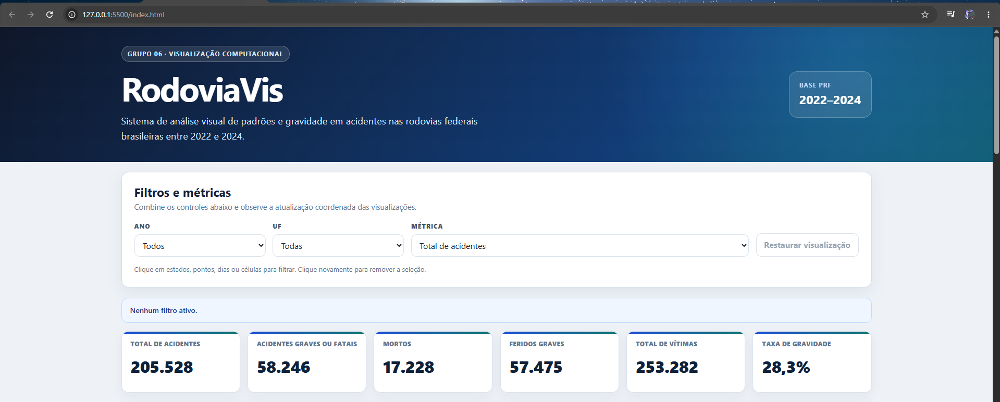
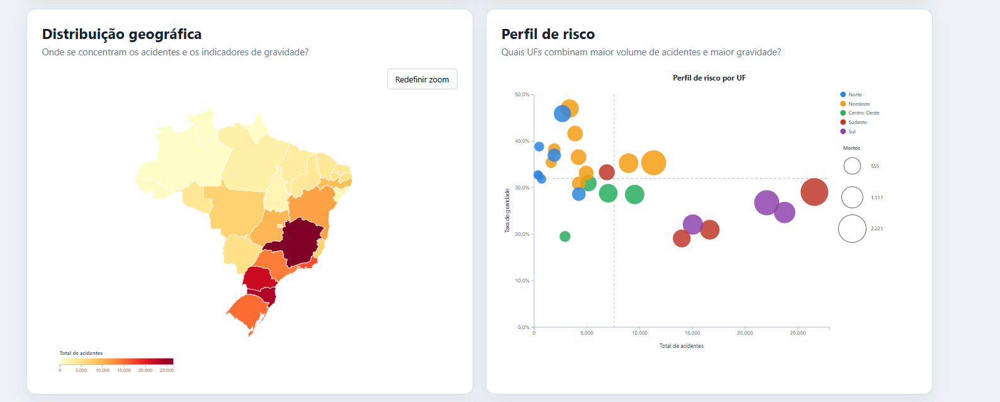
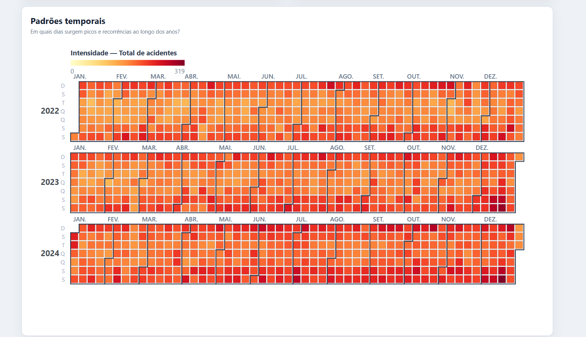
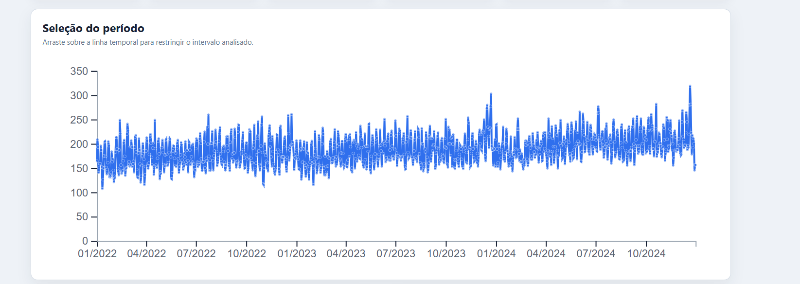
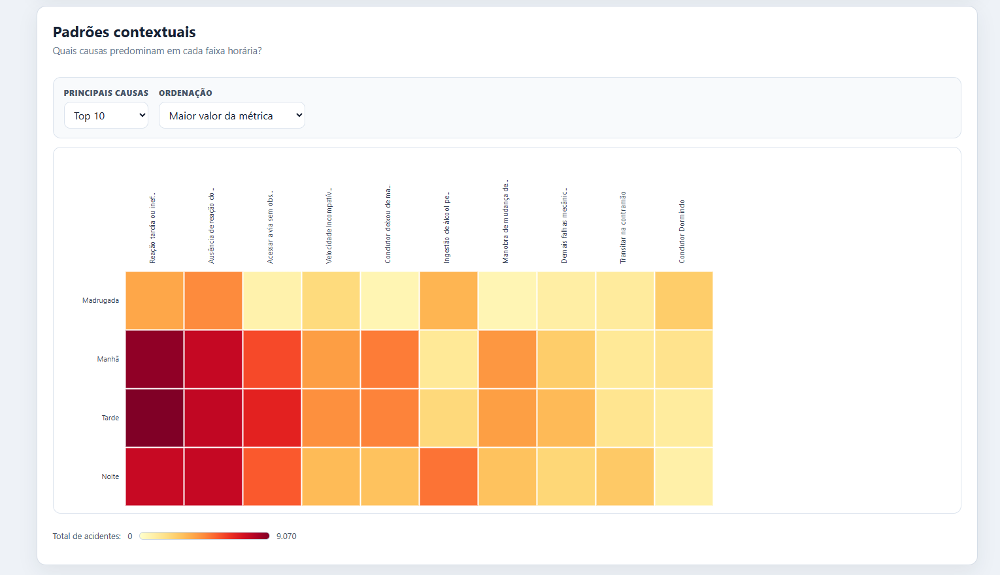

# RodoviaVis

Painel web interativo para explorar **padrões espaciais, temporais, contextuais e de gravidade** em acidentes registrados nas rodovias federais brasileiras entre 2022 e 2024.

Projeto desenvolvido em equipe como trabalho final da disciplina **GSI080 - Tópicos Especiais em Computação (Visualização Computacional)**, do Bacharelado em Sistemas de Informação da Universidade Federal de Uberlândia (UFU), e posteriormente revisado para portfólio.

**Demo:** https://guilhermecastilhomachado.github.io/rodoviavis-grupo06/



## O que o painel ajuda a investigar

O projeto foi organizado em torno de cinco perguntas analíticas:

1. **Qual é a dimensão geral do problema?** - KPIs resumem acidentes, ocorrências graves ou fatais, mortos, feridos graves, vítimas e taxa de gravidade.
2. **Onde os valores se concentram?** - o mapa coroplético compara as UFs pela métrica selecionada.
3. **Quais UFs combinam volume e gravidade?** - o scatterplot cruza total de acidentes e taxa de gravidade, usando tamanho para mortos e cor para região.
4. **Quando surgem picos e recorrências?** - calendário heatmap e linha temporal evidenciam padrões diários e sazonais.
5. **Quais causas predominam em cada faixa horária?** - a matriz contextual cruza causa do acidente e período do dia.

O objetivo é apoiar **exploração e geração de hipóteses**. O sistema é descritivo: não prevê acidentes e não estabelece causalidade.

## Visualizações

### Distribuição geográfica + perfil de risco

O mapa favorece a leitura espacial; o scatterplot complementa a análise mostrando que **volume de acidentes e gravidade proporcional não são a mesma coisa**.



### Padrões temporais

O calendário organiza cada dia em uma célula e usa intensidade de cor para destacar recorrências. A linha temporal mantém a referência de 2022 a 2024 e permite selecionar um intervalo com `brush`.





### Padrões contextuais

A matriz cruza causa e faixa horária. Os controles Top 5/10/15/Todas ajudam a reduzir sobrecarga visual e a ordenação permite alternar entre comparação por valor e leitura alfabética.



## Interação coordenada

O dashboard possui um estado compartilhado. Interações atualizam os módulos compatíveis sem recarregar a página:

- **ano e UF:** aplicados às visualizações que possuem essas dimensões;
- **métrica:** controla principalmente mapa, calendário, matriz e linha temporal;
- **período da Timeline:** atualiza KPIs, mapa e scatterplot; o calendário preserva o contexto completo e destaca visualmente o intervalo; a matriz informa que seu agregado possui granularidade anual;
- **causa e faixa horária:** atuam no contexto da matriz;
- **Restaurar visualização:** retorna o dashboard ao estado inicial.

A arquitetura e a compatibilidade entre filtros e módulos estão detalhadas em [`docs/arquitetura.md`](docs/arquitetura.md).

## Decisão técnica principal: não carregar 205 mil ocorrências no navegador

A base consolidada contém **205.528 ocorrências** e aproximadamente **71 MiB**. Ela é útil para reprodução e geração dos agregados, mas não é necessária para executar o painel.

Na versão atual, o navegador carrega apenas dois CSVs agregados:

| Arquivo | Aproximadamente | Uso no runtime |
|---|---:|---|
| `agregado_data_uf.csv` | 1,7 MB | KPIs, mapa, scatterplot, calendário e linha temporal |
| `agregado_causa_horario_uf.csv` | 0,9 MB | matriz contextual |

Os demais agregados continuam sendo gerados pelo pipeline para análise e rastreabilidade, mas não são carregados pela aplicação atual.

Essa separação deixa o runtime mais simples, reduz transferência desnecessária e mantém o processamento pesado fora do navegador.

## Arquitetura


Fluxo resumido:

```text
Dados PRF 2022-2024
        ↓
preprocessing/preparar_dados.py
        ↓
base detalhada tratada
        ↓
preprocessing/gerar_agregados.py
        ↓
agregados CSV
        ↓
app.js + state.js
        ↓
visualizações D3.js coordenadas
```

Cada módulo de visualização segue o contrato:

```javascript
Modulo.iniciar(dados);
Modulo.atualizar(filtros);
```

## Tecnologias

- **Visualização:** D3.js v7
- **Front-end:** HTML5, CSS3 e JavaScript
- **Pré-processamento:** Python, pandas e NumPy
- **Dados:** CSV e GeoJSON
- **Versionamento:** Git e GitHub

## Dados e reprodutibilidade

Fonte principal: **Polícia Rodoviária Federal (PRF) - Dados Abertos**, arquivos de acidentes agrupados por ocorrência de 2022, 2023 e 2024.

Os arquivos brutos e a base detalhada não devem ser versionados no repositório público por tamanho. Para reproduzir o processamento:

1. Baixe `datatran2022.csv`, `datatran2023.csv` e `datatran2024.csv` no portal de Dados Abertos da PRF.
2. Coloque os três arquivos em `data/raw/`.
3. Crie o ambiente Python e instale as dependências:

```powershell
py -m venv .venv
.\.venv\Scripts\Activate.ps1
python -m pip install -r requirements.txt
```

4. Execute:

```powershell
python preprocessing/inspecionar_bases.py
python preprocessing/preparar_dados.py
python preprocessing/gerar_agregados.py
```

O pipeline foi verificado regenerando os arquivos e comparando os resultados produzidos com os agregados versionados.

Mais detalhes:

- [`preprocessing/README.md`](preprocessing/README.md)
- [`data/processed/README.md`](data/processed/README.md)
- [`docs/dicionario-dados.md`](docs/dicionario-dados.md)
- [`data/geo/README.md`](data/geo/README.md)

## Execução local

Não é necessário executar o pré-processamento para abrir o painel: os agregados usados pelo runtime ficam versionados.

Na raiz do projeto:

```powershell
py -m http.server 8000
```

Acesse `http://localhost:8000`.

Também é possível utilizar a extensão Live Server no VS Code.

## Qualidade e testes

O projeto possui um roteiro de validação em [`docs/testes.md`](docs/testes.md), cobrindo:

- sintaxe JavaScript e Python;
- integridade do GeoJSON;
- carregamento dos dados;
- filtros e restauração do estado;
- interações por mouse e teclado;
- atualização coordenada;
- estados vazios;
- comportamento responsivo.

## Limitações conhecidas

- a análise é **descritiva**, não preditiva;
- totais absolutos por UF não são normalizados por frota, população, extensão da malha ou fluxo de veículos;
- a matriz contextual usa granularidade anual e, por isso, não recebe o recorte diário da linha temporal;
- o calendário mantém todos os dias visíveis para preservar contexto e destaca o período selecionado em vez de remover os demais dias;
- o sistema permite uma UF global por vez;
- o GeoJSON foi simplificado para visualização e não deve ser usado para medições cartográficas de precisão.

## Equipe e contribuições

Este é um **trabalho em equipe**. A autoria original deve permanecer explícita no portfólio.

- **Geovanna David Gonzaga:** matriz de causas por faixa horária;
- **Guilherme Castilho Machado:** preparação/agregação dos dados, arquitetura e integração, filtros, KPIs e linha temporal;
- **Tiago Magela Borges:** calendário heatmap;
- **Wothon Mateus de Araujo:** mapa coroplético e scatterplot.

Veja também [`CONTRIBUTORS.md`](CONTRIBUTORS.md).

## Documentação

- [Arquitetura](docs/arquitetura.md)
- [Decisões visuais](docs/decisoes-visuais.md)
- [Plano de testes](docs/testes.md)
- [Dicionário de dados](docs/dicionario-dados.md)
- [Relatório técnico](relatorio/Relatorio-Tecnico-RodoviaVis.pdf)

## Licenças e atribuições

Os dados de acidentes são provenientes do portal de Dados Abertos da PRF. A origem e o licenciamento do arquivo geográfico utilizado no mapa estão documentados em [`data/geo/README.md`](data/geo/README.md).

O código foi produzido por quatro integrantes. Uma licença de reutilização do código deve ser definida em conjunto pelos coautores antes de adicionar um arquivo `LICENSE` ao repositório público.
