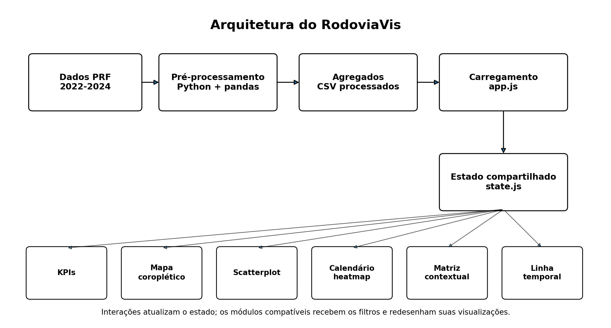

# Arquitetura do RodoviaVis

## 1. Visão geral

O RodoviaVis é uma aplicação web estática. O pré-processamento ocorre fora do navegador, em Python, e o front-end consome apenas agregados adequados às visualizações.

```text
Bases PRF 2022-2024
        ↓
preprocessing/preparar_dados.py
        ↓
base detalhada tratada (205.528 ocorrências)
        ↓
preprocessing/gerar_agregados.py
        ↓
CSVs agregados
        ↓
js/app.js → js/state.js → módulos D3.js
```



## 2. Dados consumidos pelo runtime

A versão atual do front-end carrega somente os agregados necessários para a interação disponível no painel:

| Arquivo | Finalidade no runtime |
|---|---|
| `agregado_data_uf.csv` | KPIs, mapa, scatterplot, calendário e linha temporal |
| `agregado_causa_horario_uf.csv` | matriz contextual |
| `data/geo/brasil_estados.geojson` | geometria das UFs no mapa |

Os arquivos `agregado_uf_ano.csv`, `agregado_mes_uf.csv` e `perfil_uf_ano.csv` continuam sendo gerados pelo pipeline para rastreabilidade e análises auxiliares, mas não são carregados pelo navegador na versão atual.

A base detalhada `acidentes_2022_2024.csv` também não é carregada no front-end. Ela serve como produto intermediário reproduzível do pipeline e como origem dos agregados.

## 3. Módulos JavaScript

| Arquivo | Responsabilidade |
|---|---|
| `app.js` | carregar os agregados do runtime, inicializar módulos, coordenar atualizações e tratar falhas |
| `state.js` | armazenar filtros e notificar ouvintes |
| `utils.js` | conversões, formatação, filtragem, agregação e tooltip compartilhada |
| `filtros.js` | sincronizar os controles globais com o estado |
| `kpis.js` | calcular e exibir indicadores gerais a partir do agregado diário |
| `mapa.js` | mapa coroplético e seleção de UF |
| `scatterplot.js` | perfil de risco por UF |
| `calendario.js` | heatmap diário e seleção de data |
| `matriz.js` | relação entre causa e faixa horária |
| `timeline.js` | série diária e brush temporal |

## 4. Contrato dos módulos

Cada módulo expõe:

```javascript
Modulo.iniciar(dados);
Modulo.atualizar(filtros);
```

`iniciar` constrói a estrutura visual e registra eventos. `atualizar` recebe uma cópia dos filtros atuais e redesenha apenas o necessário.

## 5. Estado compartilhado

O estado contém:

```text
ano, uf, mes, dataInicial, dataFinal,
causa, faixaHorario e metrica
```

As alterações passam por `definirFiltro`, `definirFiltros` ou `resetarFiltros`. Os módulos não alteram `Estado.filtros` diretamente.

### Compatibilidade dos filtros

Nem todo agregado possui todas as dimensões. A aplicação preserva essa diferença em vez de simular uma precisão que os dados não possuem.

| Filtro/interação | KPIs | Mapa | Scatterplot | Calendário | Matriz | Timeline |
|---|:---:|:---:|:---:|:---:|:---:|:---:|
| Ano | ✓ | ✓ | ✓ | ✓ | ✓ | ✓ |
| UF | ✓ | ✓ | ✓ | ✓ | ✓ | ✓ |
| Métrica | exibe todos os KPIs | ✓ | métricas fixas | ✓ | ✓ | ✓ |
| Período diário | ✓ | ✓ | ✓ | mantém contexto e destaca | não aplica | controla seleção |
| Causa/faixa horária | - | - | - | - | ✓ | - |

A matriz mostra uma nota quando existe um período diário ativo porque seu agregado possui granularidade anual.

## 6. Inicialização

1. `app.js` carrega os dois CSVs usados no runtime em `Promise.all`.
2. Os registros são convertidos para números, booleanos e objetos `Date`.
3. `inicializarModulos()` chama `iniciar(dados)`.
4. `app.js` inscreve `atualizarDashboard` no estado.
5. Cada mudança de filtro chama `atualizar(filtros)` nos módulos.

## 7. Linked views

A coordenação acontece por estado compartilhado, não por chamadas diretas entre gráficos. Um módulo altera o estado; o estado notifica a aplicação; os módulos compatíveis são atualizados.

Exemplo:

```text
clique em MG no mapa
        ↓
definirFiltro('uf', 'MG')
        ↓
state.js notifica os ouvintes
        ↓
atualizarDashboard()
        ↓
KPIs + mapa + scatterplot + calendário + matriz + timeline recebem UF = MG
```

Essa separação reduz acoplamento: o mapa não precisa conhecer a implementação do calendário ou do scatterplot.

## 8. Tratamento de erros e estados vazios

- falhas de carregamento geram mensagem visível para o usuário;
- erro em um módulo é capturado sem impedir a atualização dos demais;
- estados vazios usam mensagens compartilhadas;
- atualizações reutilizam estruturas existentes para evitar SVGs duplicados.

## 9. Responsividade e acessibilidade

- layout em grade para desktop e empilhamento em telas menores;
- áreas de rolagem para visualizações SVG extensas;
- foco de teclado visível;
- elementos interativos com rótulos acessíveis;
- Enter/Espaço em interações aplicáveis;
- texto de filtros ativos em região `aria-live`;
- tooltips complementam a leitura, mas não são a única indicação de seleção.
